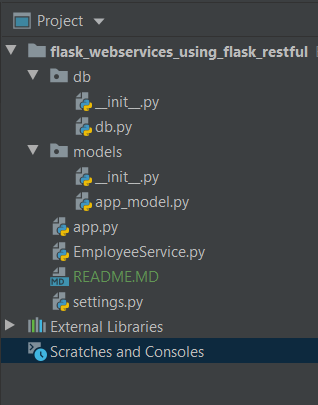

# Flask Webservices Using Flask-Restful :


#### Project Setup

  - Making the project as :
    ```
    mkdir flask_webservices_using_flask_restful
	cd flask_webservices_using_flask_restful
    ```
  - Install flask:
    ```
    pip3 install flask
    ```
 - Integrating SqlAlchemy
    ```
    pip3 install sqlalchemy
    ```
  - Integrating flask-rest
    ```
    pip3 install flask-restful
    pip3 install flask_restful_swagger
    ``` 
  - create project architecture like below
  
      
     
  - Create EmployeeService.py for development
     ```python
    from flask import jsonify
    from sqlalchemy.orm.exc import NoResultFound
    from db.db import db
    from models.app_model import Employee
         
    def get_employees():
        employees = Employee.query.all()
        employees = jsonify(employees=[e.serialize() for e in employees])
        return employees if employees is not None else 404
    
    
    def get_employee(employee_id):
        employee = Employee.query.filter_by(id=employee_id).first()
        if employee:
            return jsonify(employee=employee.serialize())
        else:
            return 'No row was found for given id %s' % employee_id
    
    
    def create_employee(name, email, contact):
        employee = Employee(name=name, email=email, contact=contact)
        db.session.add(employee)
        db.session.commit()
        return jsonify(employee=employee.serialize())
    
    
    def update_employee(employee_id, name, email, contact):
        employee = Employee.query.filter_by(id=employee_id).first()
        employee.name = name
        employee.email = email
        employee.contact = contact
        db.session.commit()
        return 'Updated a Employee with id %s' % employee_id
    
    
    def delete_employee(employee_id):
        try:
            employee = Employee.query.filter_by(id=employee_id).one()
            db.session.delete(employee)
            db.session.commit()
        except NoResultFound as e:
            return 'No row was found for given id %s' % employee_id
        return 'Removed Employee with id %s' % employee_id

     ```   
  - Create app.py for development
     ```python
    from flask import Flask, request
    from EmployeeService import get_employees, create_employee, update_employee, delete_employee, get_employee
    from db.db import db
    from flask_restful import Api, Resource
    from flask_restful_swagger import swagger
    from models.app_model import Employee
    
    app = Flask(__name__)
    app.secret_key = 'asrtarstaursdlarsn'
    app.config.from_object('settings.Config')
    api = Api(app)
    api = swagger.docs(Api(app), apiVersion='0.1')
    
    # initialization
    db.init_app(app)
    
    
    # http://docs.swagger.io/spec.html
    class Employees(Resource):
    
        @swagger.operation(
            notes='This is Get Api for particular employee',
            responseClass=Employee.__name__,
            responseMessages=[
                {
                    "code": 200,
                    "message": "Loaded. "
                },
                {
                    "code": 405,
                    "message": "Invalid input"
                }
            ]
        )
        def get(self):
            print(get_employees())
            return get_employees()
    
        @swagger.operation(
            notes='This is POST Api',
            responseClass=Employee.__name__,
            nickname='upload',
            parameters=[
                {
                    "name": "body",
                    "description": "Insert Employee",
                    "required": True,
                    "allowMultiple": False,
                    "dataType": Employee.__name__,
                    "paramType": "body"
                }
            ],
            responseMessages=[
                {
                    "code": 200,
                    "message": "Loaded. "
                },
                {
                    "code": 405,
                    "message": "Invalid input"
                }
            ])
        def post(self):
            data = request.get_json()
            return create_employee(name=data['name'], email=data['email'], contact=data['contact'])
    
        @swagger.operation(
            notes='This is POST Api',
            responseClass=Employee.__name__,
            nickname='upload',
            parameters=[
                {
                    "name": "body",
                    "description": "Insert Employee",
                    "required": True,
                    "allowMultiple": False,
                    "dataType": Employee.__name__,
                    "paramType": "body"
                }
            ],
            responseMessages=[
                {
                    "code": 200,
                    "message": "Loaded. "
                },
                {
                    "code": 405,
                    "message": "Invalid input"
                }
            ])
        def put(self):
            data = request.get_json()
            return update_employee(employee_id=data['id'], name=data['name'], email=data['email'], contact=data['contact'])
    
    
    class EmployeeApi(Resource):
    
        @swagger.operation()
        def get(self, employee_id):
            return get_employee(employee_id)
    
        @swagger.operation()
        def delete(self, employee_id):
            return delete_employee(employee_id)
    
    
    api.add_resource(EmployeeApi, '/employee/<int:employee_id>')
    api.add_resource(Employees, '/employee')
    
    # run always put in last statement or put after all @app.route
    if __name__ == '__main__':
        app.run(host='localhost')
     ```
  - Declaring Models:
     ```python
    from db.db import db
    from flask_restful_swagger import swagger
    
    @swagger.model
    class Employee(db.Model):
        id = db.Column(db.Integer, primary_key=True)
        name = db.Column(db.String(255), nullable=False)
        email = db.Column(db.String(255), nullable=False)
        contact = db.Column(db.String(10), nullable=False)
    
        def serialize(self):
            return {
                'name': self.name,
                'email': self.email,
                'contact': self.contact,
                'id': self.id,
            }
      
     ``` 
  - In order to run app:
     ```
	   python app.py
     ```

  - run on your Postman
    * You should run get employees: http://localhost:5000//employee/
        you should run get by id: http://localhost:5000//employee/<int:employee_id>
  
  - run on your Browser for Swagger: 
    * You should run get employees: http://localhost:5000/api/spec.html           